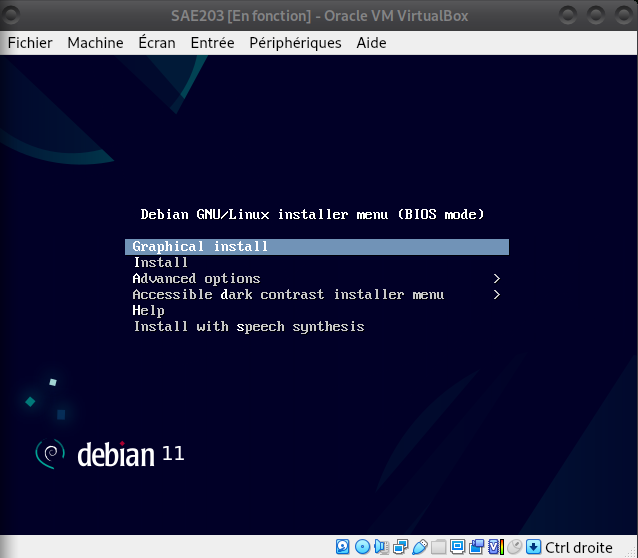
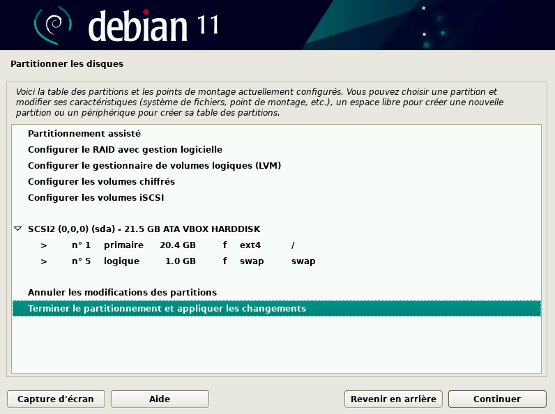
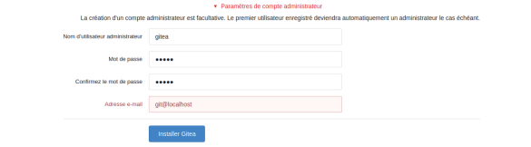
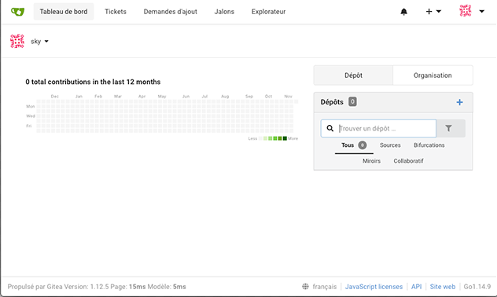

<link rel="stylesheet" href="style.css">

# Rapport Final - SAE 2.03

## DORMAEL Louis, DHORME Victor, DELESPIERRE Jules - Groupe C

<a id="1-sommaire"></a>

---

## 1. Sommaire

1. [Sommaire](#1-sommaire)

2. [Introduction](#2-introduction)

3. [Installation de Debian](#3-installation)

4. [Analyse comparative des interfaces clients Git](#4-analyse)

5. [Installation *Gitea*](#5-installationGitea)

6. [Utilisation *Gitea*](#6-utilisationGitea)

7. [Index](#7-index)

<a id="2-introduction"></a>

---

## 2. Introduction

Notre SAE s'est basé sur le système d'exploitation Debian, où nous avons installer un système d'exploitation par plusieurs moyens (Installation graphique, Installation automatisée et sans interface graphique) et installer un logiciel nommé *Gitea*.

Pour commencer : Qu'est-ce *Debian* ?

<a id="index-debian"></a>

Le projet <mark>Debian</mark> est un groupe de développeurs volontaires, qui cherchent à créer un système d'exploitation composé de logiciels libres. A sa création c'est la seule distribution ouverte aux contributions de tout développeur ou utilisateur. C'est toujours **le seul distributeur Linux majeur qui ne soit pas une entité commerciale.** &nbsp;Le nom Debian vient de 2 prénoms celui de l'épouse du créateur de l'OS "Debra" et de son créateur "Ian", ce qui a donné "Debian". De plus ce système a un gros atouts, en effet il est compatible avec [9 architectures de processeurs](https://wiki.debian.org/DebianBullseye#Architectures)
Debian a plusieurs versions, ces versions ont des "durées de vie", en effet <mark>[la durée minimale de prise en charge](https://wiki.debian.org/fr/DebianReleases)</mark> est environ de 3 ans, pour la durée en <mark>[support long terme](https://wiki.debian.org/fr/LTS)</mark>, le temps est d'environ de 2 ans supplémentaires de la durée minimale. Et la durée en <mark>[support long terme étendue](https://wiki.debian.org/fr/LTS/Extended)</mark> ajoute 5 ans supplémentaires au LTS, 10 ans cumulés. Même s'il est mieux d'avoir la dernière version du système, les mises à jours de sécurité sont assurées pendant la durée minimale et le support à long terme, mais elles ne le sont pas pour le support en long terme étendue. A ce jour les <mark>[versions de Debian](https://wiki.debian.org/fr/DebianReleases)</mark> encore maintenues sont Bullseye et Buster. Les noms des versions sont des [références](https://wiki.debian.org/DebianBuzz) à la saga des studios Pixar, "Toy Story".
En effet, la première version sorti en 1996 s'appelle [Buzz](https://wiki.debian.org/DebianBuzz), en réference à Buzz L'éclair, et la dernière s'appelle [Forky](https://wiki.debian.org/DebianForky), le nom de la fourchette dans le dernier opus de la saga.

<a id="3-installation"></a>

---

## 3. Installation de Debian

<a id="index-image"></a>

Pour installer Debian, nous avons utilisé une machine virtuelle ! Il faut d'abord introduire l'<mark>image</mark> (la représentation numérique d'un système d'exploitation utilisée pour installer et configurer le système sur un ordinateur), pour nous donc on a utilisé l'[image de base de Debian](https://cdimage.debian.org/debian-cd/current/amd64/iso-cd/), puis nous avons fait une installation basique.

<a id="index-iso-architecture"></a>

L'image est un <mark>fichier iso bootable</mark>, c'est à dire que c'est un fichier d’extension iso, qui contient des composants logiciel, qui peuvent être démarré directement sur l’ordinateur sans passer par un système d’exploitation. Il est donc fortement utilisé pour une installation de système d’exploitation

Debian utilise une <mark>architecture</mark> de 64 bits, 64 bits signifie que les informations qu’envoie les informations au processeur, sont codées sur 64 bits, un système d’exploitation 64 bits est donc conçu pour un processeur avec une architecture 64 bits.



<a id="index-superutilisateur-partitionnement"></a>

Durant l'installation, nous devons configurer l'heure, la date, la gestion des utilisateurs et du <mark>[superutilisateur](https://wiki.debian.org/fr/Root)</mark> (utilisateur qui possède tous les droits sur la machine). Pour qu'un utilisateur lambda possède des droits, il faut utiliser la commande `adduser user sudo` permet d’ajouter l’utilisateur user au groupe sudo.

Ensuite l'étape suivante est un peu plus délicate car il s'agit du <mark>[partitionnement du disque](https://wiki.debian.org/DiskPartitioning)</mark>, il permet la création de partitions distinctes pour les fichiers système, les applications et les données utilisateur. Ce partitionnement améliore les performances en réduisant la fragmentation des fichiers et en permettant une gestion plus efficace des disques.




<a id="index-commposants"></a>

Il faut aussi choisir des <mark>composants</mark> qu'on souhaite installer comme MATE, GNOME, un serveur WEB, SSH, ou encore mandataire. MATE est un environnement de bureau (Permet de manier l’ordinateur via un environnement graphique), alors que GNOME est un environnement graphique (dispositif de dialogue homme-machine, dans lequel les objets à manipuler sont dessinés sous forme de pictogrammes à l'écran). Un serveur web est un ordinateur dédié à l'hébergement de sites internet, qui gère les demandes des clients (navigateurs web) en leur transmettant les pages web demandées. Un serveur SSH est un serveur qui permet à des utilisateurs de se connecter de manière sécurisée à un ordinateur distant en utilisant le protocole SSH, pour transférer des fichiers ou exécuter des commandes par exemple. Un serveur mandataire est un serveur qui agit comme un intermédiaire entre un client et d'autres serveurs. Le client envoie une demande à un serveur mandataire, qui se connecte alors au serveur cible et transmet la demande.

Ceci est une installation basique de Debian, mais l'utilisateur doit être présent afin de configurer la machine.

<a id="index-pressed"></a>

Il existe une façon d'installer un système d'exploitation automatiquement, pour Debian ce système s'appelle <mark>[*Pressed*](https://wiki.debian.org/DebianInstaller/Preseed)</mark> ; c'est est un outil qui permet d'installer automatiquement le système d'exploitation Debian sur un ordinateur sans que l'utilisateur ait à répondre à toutes les questions posées pendant l'installation. Au lieu de cela, il suffit de créer un fichier de configuration contenant toutes les réponses aux questions posées, comme la langue, la zone horaire, le nom d'utilisateur, le mot de passe, etc.

<a id="4-analyse"></a>

---

## 4. Analyse comparative des interfaces clients Git

Qu'est-ce une interface *Git* ?

<a id="index-interface-git"></a>

Une <mark>[interface *Git*](https://www.atlassian.com/fr/git/tutorials/what-is-git)</mark> est une méthode d'interaction avec [*Git*](https://git-scm.com/), un système de contrôle de version distribué open-source utilisé pour suivre les modifications apportées à un ensemble de fichiers au fil du temps.

Par exemple, <mark>[Gitk](https://www.atlassian.com/fr/git/tutorials/gitk)</mark> est une interface graphique pour Git, qui permet de visualiser les commits, les branches et les tags d'un projet Git. Gitk est installé avec Git et peut être lancé en utilisant la commande gitk dans le terminal.

Les interfaces *Git* sont nombreuses, à peu-près **une centaine**, allant d'interfaces pour le grand public au interfaces très professionelles, nous en avons choisi 6 :

* GitKraken
* Github Desktop
* Git GUI
* Git Bash
* Git Cola
* TortoiseGit

Nos critères ont été les suivants :

* L'interface est-elle graphique ?
* L'interface est-elle en ligne de commande ?
* Est-elle facile d'usage ? (C'est assez relié avec l'interface graphique, car s'il y a une interface graphique, cela est beaucoup plus accessible par tous.)
* Sur quelles platformes l'interface est disponible ?
* La licence utilisée par cette interface.
* Le développeur du service d'intégration de service Git.
* Si l'interface est personalisable graphiquement.
* L'interface possède un historique visuel ?
* Si le support multi-utilisateur est pris en charge.

| Interface | Interface graphique | Interface en ligne de commande | Niveau de complexité | Plateformes prises en charge | Licence | Intégration de service Git hébergé | Personnalisation | Historique visuel | Support multi-utilisateur |
| --- | --- | --- | --- | --- | --- | --- | --- | --- | --- |
| GitKraken | Oui | Non | Moyen | Windows, Mac, Linux | Propriétaire | [GitKraken](https://www.gitkraken.com/) | [Personnalisation des couleurs et des thèmes](https://help.gitkraken.com/gitkraken-client/themes/) | Oui, avec des graphiques de flux de travail | Oui, avec [un panneau de configuration](https://help.gitkraken.com/gitkraken-client/gitkraken-manage-account/) |
| GitHub Desktop | Oui | Non | Facile | Windows, Mac | Gratuit | [GitHub Desktop](https://desktop.github.com/) | [Personnalisation limitée](https://docs.github.com/fr/desktop/installing-and-configuring-github-desktop/configuring-and-customizing-github-desktop/setting-a-theme-for-github-desktop) | Oui, avec des graphiques de flux de travail | Non |
| Git GUI | Oui | Oui | Moyen | Windows, Mac, Linux | Gratuit | [Git for Windows](https://gitforwindows.org/) | [Personnalisation limitée](https://git-scm.com/book/en/v2/Customizing-Git-Git-Configuration) | Non | Non |
| Git Bash | Non | Oui | Élevé | Windows, Mac, Linux | Gratuit | [Git for Windows](https://gitforwindows.org/) | Aucune | Non | Non |
| Git Cola | Oui | Oui | Élevé | Windows, Mac, Linux | Gratuit | [Git Cola](https://git-cola.github.io/) | [Personnalisation limitée](https://git-cola.readthedocs.io/en/latest/git-cola.html#configure-your-editor) | Non | Non |
| TortoiseGit | Oui | Non | Moyen | Windows | Gratuit | [TortoiseGit](https://tortoisegit.org/) | [Personnalisation limitée](https://tortoisegit.org/docs/tortoisegit/tgit-dug-settings.html) | Oui, avec des graphiques de flux de travail | Non |

<a id="5-installationGitea"></a>

---

## 5. Installation *Gitea*

<a id="index-gitea-open-source"></a>

<mark>[*Gitea*](https://gitea.io/en-us/)</mark> est une solution open source de gestion de projets Git, qui permet aux développeurs de collaborer sur un même projet en toute simplicité. *Gitea* est écrit en langage de programmation Go et est conçu pour être léger, rapide et facile à installer et à utiliser.
Un logiciel <mark>[Open source](https://fr.wikipedia.org/wiki/Open_source)</mark> signifie que tout le monde a accès à son code source (d'où "open source"), cela permet aux programmeurs de contribuer également sur le logiciel. De plus, ce logiciel est écrit en [*Go*](https://fr.wikipedia.org/wiki/Go_(langage)), c'est un langage de programmation developpé par Google en 2007. Il a la réputation d'être simple, sécurisé et rapide, et est proche du langage C.

<a id="index-binaire"></a>

La première étape de l'installation est de télécharger le <mark>[binaire du logiciel](https://www.debian.org/doc/manuals/debian-faq/pkg-basics.en.html)</mark>, les fichiers binaires sont utilisés pour installer des programmes et bibliothèques sur un système Debian, et ils peuvent être exécutés pour fournir une fonctionnalité à l'utilisateur. Pour notre cas nous allons utiliser la commande suivante.

```bash
wget -O gitea https://dl.gitea.com/gitea/1.18.5/gitea-1.18.5-linux-amd64
```

<a id="index-executable"></a>

Puis nous allons rendre le <mark>fichier exécutable</mark>, c'est à dire qu'il sera possible pour l'ordinateur de lancer le logiciel, pour cela nous devons le rendre exécutable via la commande `chmod` qui permet de modifier les permissions des fichiers. Il faut donc se rendre avec le terminal dans le dossier du fichier *Gitea*.

```bash
cd /usr/bin/gitea
chmod +x fichierinstallation
```

Ensuite, il faut créer l'environnement de *Gitea*, pour cela tout est inscrit sur [le site officiel de *Gitea*](https://docs.gitea.io/en-us/install-from-binary/). De plus, si on veut que *Gitea* se lance dès le démarrage, il faut faire une petite manipulation :

* Créer un fichier nommé `gitea.service` dans le dossier `/etc/systemd/system`

    ```bash
    cd /etc/systemd/system
    touch gitea.service 
    ```

* Ensuite se rendre sur le [GitHub associé à ce fichier](https://docs.gitea.io/en-us/install-from-binary/) et copier l'intégralité de ce fichier
* Allumer l'éditeur de texte dans le fichier que nous avions créé

    ```bash
    nano gitea.service
    ```

    et coller le fichier GitHub.

* Puis faire les deux commandes suivantes, qui prennent en considération la manipulation que nous venons de faire

    ```bash
    sudo systemctl enable gitea
    sudo systemctl start gitea
    ```

<a id="6-utilisationGitea"></a>

---

## 6. Utilisation *Gitea*

Avant d'utiliser *Gitea*, nous devons faire la première configuration, pour cela nous mettons en base de données **SQLite3**, et nous configurons le compte administrateur :



avec comme mot de passe **gitea** !

<a id="index-depot"></a>

L'interface web de Gitea nous permet de mettre un nouveau <mark>[dépôt](https://www.atlassian.com/fr/git/tutorials/setting-up-a-repository)</mark>, un dépot est un nouvel espace virtuel dans  lequel, on peut enregistrer des versions de notre code.



Un problème pourrait se produire dès lors de votre premier dépôt, il faut vérifier que la configuration soit la bonne, et bien regarder si nous avons les permissions de créer des dépôts et déposer des fichiers dessus.

<a id="7-index"></a>

---

## 7. Index

* A
    * [Architecture](#index-iso-architecture)
* B
    * [fichier Binaire du logiciel](#index-binaire)
* C
    * [Composants (Mate, Gnome, serveur WEB, serveur SSH, serveur mandataire)](#index-composants)
* D
    * [Debian](#index-debian)
    * [Depôt *Git*](#index-depot)
    * [Durée minimale de prise en charge](#index-debian)
* E
    * [fichier Éxécutable](#index-executable)
* G
    * [*Gitea*](#index-gitea-open-source)
    * [Gitk](#index-interface-git)
* I
    * [Image](#index-image)
    * [Interface *Git*](#index-interface-git)
    * [fichier ISO bootable](#index-iso-architecture)
* O
    * [Open-source](#index-gitea-open-source)
* P
    * [Partitionnement du disque](#index-superutilisateur-partitionnement)
    * [*Pressed*](#index-pressed)
* S
    * [Superutilisateur](#index-superutilisateur-partitionnement)
    * [Support long terme](#index-debian)
    * [Support long terme étendue](#index-debian)